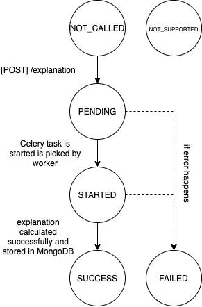

# Root Cause Service

Hydro serving models used in demos are stored in [hs_demos](hs_demos).

You can test anchor and rise with `python tests/test_anchor_on_multiple_adult_models.py` and `test/test_rise_on_mobilenet.py` correspondingly.  

## Explanation State Diagram

## Which models are eligible for creating an auto-od metric?
 hydro-root-cause creates explanations for tabular or image tensors.
 > Right now only tabular explanations are available
  
If model signature is not supported, then there are no way to ask for explanation and explanation status will always be `NOT_SUPPORTED`
 
 Model signature is considered supported when it consists of numerical scalar fields only. It should also have output field with name
 specified in `config['explained_output_field_name']`. If there are no such tensor, model signature will be considered `NOT_SUPPORTED`.
 You can change this tensor by update config during runtime, and model status will be refreshed.

 Supported fields are:
 * of scalar shape
 * of types:
    * DT_FLOAT
    * DT_DOUBLE
    * DT_INT8
    * DT_INT16
    * DT_INT32
    * DT_INT64

In future more model fields will be supported.

## Environment variables to configure service while deploying
Addresses to other services:
* `HTTP_UI_ADDRESS` - http address of hydro-serving cluster, used to create `hydrosdk.Cluster(HS_CLUSTER_ADDRESS)`
* `GRPC_UI_ADDRESS` - grpc address

MongoDB parameters:
* `MONGO_URL`
* `MONGO_PORT` 
* `MONGO_AUTH_DB` 
* `MONGO_USER` 
* `MONGO_PASS`
* `ROOT_CAUSE_DB_NAME` - Name of database in mongo which will be used for this service

AWS/Minio parameters:
* `AWS_ACCESS_KEY_ID`
* `AWS_SECRET_ACCESS_KEY`
* `S3_ENDOPOINT`, if no s3 endpoint is present, data will be downloaded with boto3

Flask server parameters:
* `APPLICATION_ROOT` - prefix of all routes specified in [hydro_auto_od_openapi.yaml](hydro-auto-od-openapi.yaml), not used right now
* `DEBUG`